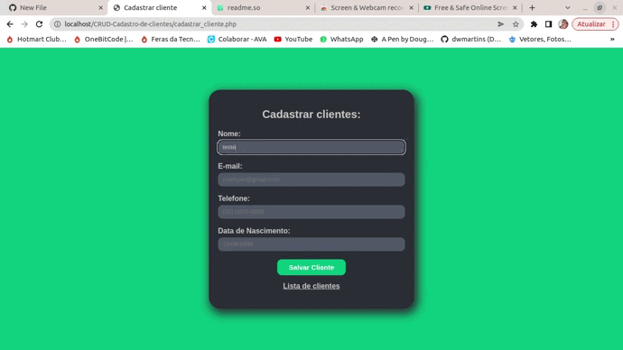

# Cadastro de clientes CRUD

Desenvolvimento de uma lista de clientes feito com PHP, com conexão com o banco de cados.
Podendo cadastrar novos clientes, editar e excluir. 

## Pré visualização:

  

## Páginas

- **Lista de clientes:**

  

- **Página de Cadastro:**

  

